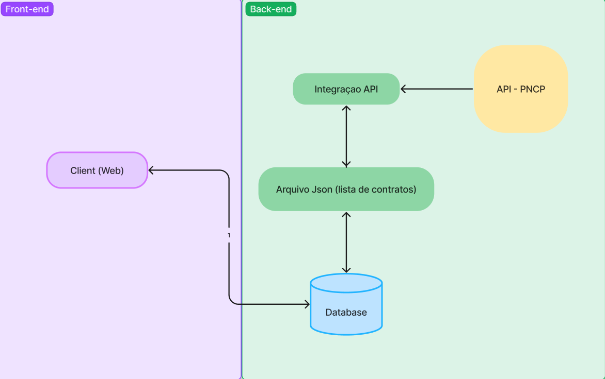

### Introdução 
O projeto LicitaNow visa verificar e mostrar aos usuários os gastos públicos do Distrito Federal na modalidade dispensa de licitação. Tendo como objetivo apresentar, de forma organizada, quais empresas recebem mais dinheiro e quais são os órgãos públicos que gastam mais.

### Diagrama de arquitetura 

### Front-End

#### HTML, CSS e JavaScript:
- *Estrutura e Estilo:* Para criar a interface inicial do nosso projeto, utilizamos HTML para estruturar o conteúdo e CSS para estilizar os elementos. Além disso, utilizamos JavaScript para adicionar interatividade à página.
- *Conteúdo Principal:* O HTML define a estrutura básica da página, incluindo cabeçalho, seções de conteúdo, e rodapé. O CSS é responsável pela aparência visual, incluindo cores, espaçamentos, e fontes. O JavaScript adiciona comportamento dinâmico, como animações e reações a eventos de usuário.

#### Integração com Streamlit:
- *Incorporação de HTML/CSS/JS no Streamlit:* Utilizamos a biblioteca streamlit.components.v1 para incorporar o nosso código HTML, CSS e JavaScript dentro do aplicativo Streamlit. Isso nos permitiu combinar a flexibilidade do desenvolvimento web tradicional com a simplicidade e o poder do Streamlit.
- *Código de Integração:* O código abaixo demonstra como carregamos e incorporamos os arquivos HTML, CSS e JavaScript no Streamlit:

        import streamlit as st
        import streamlit.components.v1 as components

        st.set_page_config(layout="wide")

        # Função para carregar o conteúdo do arquivo
        def load_file(file_path):
            with open(file_path, 'r', encoding='utf-8') as file:
                return file.read()

        # Carregar o HTML, CSS e JavaScript
        html_content = load_file('index.html')
        css_content = load_file('style.css')
        js_content = load_file('script.js')

        # Injetar o CSS e JavaScript no HTML
        html_with_css_js = f"""
            
            

                {html_content}
            

            
        # Exibir o HTML com CSS e JavaScript no Streamlit
        components.html(html_with_css_js, height=1000, scrolling=True)

### Back-End

#### Biblioteca Streamlit:
- *Criação de Interfaces Interativas:* Utilizamos a biblioteca Streamlit para desenvolver o restante da interface do usuário e das funcionalidades interativas. Streamlit é uma ferramenta poderosa para criar dashboards e aplicativos de dados de maneira rápida e eficiente.
- *Funcionalidades:* Com Streamlit, implementamos funcionalidades como carregamento e visualização de dados, gráficos interativos, e controle de entradas do usuário (como sliders e botões).

#### Fluxo de Trabalho:
- *Entrada de dados:* Os dados são carregados a partir de fontes especificadas (arquivos, APIs, etc.).
- *Processamento e Análise:* Os dados são processados e analisados em tempo real, utilizando bibliotecas de manipulação de dados.
- *Visualização:* Os resultados são apresentados de forma intuitiva através de gráficos, tabelas e outras visualizações interativas.

### Conclusão

A combinação de HTML, CSS e JavaScript para a estrutura e estilo inicial, junto com a biblioteca Streamlit para funcionalidades interativas e visualizações de dados, nos permitiu criar uma aplicação robusta e fácil de usar. Esta abordagem nos permitiu oferecer uma melhor combinação entre: a flexibilidade e personalização do desenvolvimento web tradicional, e a simplicidade e eficiência do Streamlit para análise de dados.

### Índice de Arquivos

#### coleta_api.py
Faz buscas no API do PNCP, como resultado, ele gera um arquivo Json

#### coleta_cnpj.py
Faz buscas do casdastro de CNPJ no API https://api.cnpjs.dev/v1 utilizando o arquivo 'contratos_OFICIAL.json' e adiciona a ele o resultado das buscas

#### contratos_final_excel.py
Organiza o arquivo Json para que possa ser lido pelo "ordenacao_dados.py"

#### ordenacao_dados.py
Organiza o arquivo Json para que possa ser lido pelo dashboard, consolida com as informações do arquivo "contrato_final1.xlsx", além de possíbilitar ao usuário que o baixe para trabalhá-lo em planilha Excel > Gera o arquivo "contratos_ordenados_completo.csv"

#### info_empresa.py
verificar a necessidade de manter este arquivo, pois parece que não tem mais utilidade para o projeto

- Lê o arquivo"x_empresas_contratadas.json" e gera o arquivo 'x_empresas_contratadas.csv'

#### Rank_empresas.py
Página de arquivos do ranking das empresas

#### Rank_dos_órgãos.py
Página de arquivos do ranking dos órgãos conntratantes

#### Contato.py
Contato do organização do projeto

#### Sobre.py
Sobre nós

#### Menu.py
Menu do Dashboard Interativo
